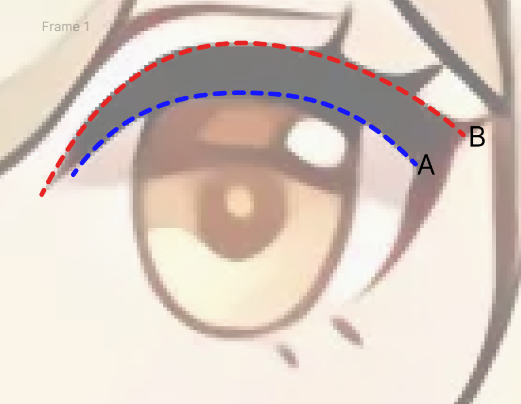
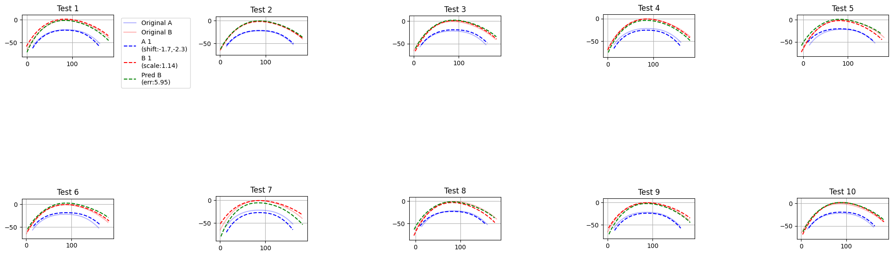

# Deep Learning-Based Automatic Eyelash Curve Generation for Anime Characters

## Abstract

This research presents a deep learning approach based on Multi-Layer Perceptron (MLP) for automatically generating eyelash curves in anime character designs. By analyzing the geometric relationship between eye contours and eyelashes, we establish an end-to-end prediction model. Experimental results demonstrate that this method effectively captures eyelash morphological features, achieving an average error of 5.02±2.81 pixels, providing an efficient automated solution for animation production.



## 1. Introduction

In anime character design, eye detail rendering significantly impacts character expressiveness. Eyelashes, as crucial eye features, require careful coordination with eye contours, traditionally demanding substantial time and effort from professional animators. This research aims to leverage deep learning technology to automate eyelash curve generation, enhancing animation production efficiency.

## 2. Methodology

### 2.1 Data Representation

Our research employs curve parameterization to convert eye contours (Curve A) and eyelash curves (Curve B) into unified parameter representations. By establishing local coordinate systems, complex spatial relationships are decomposed into tangential and normal components, providing normalized input features for the deep learning model.

Let $$\gamma_A(t)$$ and $$\gamma_B(t)$$ represent the eye contour and eyelash curves respectively, where $t \in [0,1]$ is the normalized arc length parameter. The curves are parameterized as:

$$\gamma_A(t) = (x_A(t), y_A(t))$$
$$\gamma_B(t) = (x_B(t), y_B(t))$$

The tangent vector $$T(t)$$ and normal vector $$N(t)$$ at any point on curve A are computed as:

$$T(t) = \frac{\gamma_A'(t)}{|\gamma_A'(t)|}$$
$$N(t) = (-T_y(t), T_x(t))$$


### 2.2 Curve Parameterization

The parametric equations are defined as:

$$
\begin{cases}
X = L_A \cdot s \\
Y = x_B(t(s)) \\
Z = y_B(t(s))
\end{cases}
$$

where $L_A$ is the length of curve A, $s$ is the normalized arc length parameter, and $t(s)$ is the corresponding parameter value on curve B.

### 2.3 Network Architecture

The model adopts a multi-layer perceptron structure with the following forward propagation:

For each layer $l$, the output $$h^{(l)}$$ is computed as:

$$h^{(l)} = \text{ReLU}(W^{(l)}h^{(l-1)} + b^{(l)})$$

where $$W^{(l)}$$ and $$b^{(l)}$$ are the weights and biases of layer $l$.

The final output layer produces the offset predictions:

$$[\Delta s, \Delta n] = W^{(out)}h^{(L)} + b^{(out)}$$

where $$\Delta s$$ and $$\Delta n$$ are the tangential and normal offsets respectively.

Training configuration:

* Optimizer: Adam
* Loss function:

  $$L_{MSE} = \frac{1}{N}\sum_{i=1}^N(\hat{y}_i - y_i)^2$$

* Evaluation metric:

  $$MAE = \frac{1}{N}\sum_{i=1}^N|\hat{y}_i - y_i|$$

### 2.4 Relative Motion Analysis

Through arc length parameterization and local coordinate system transformation, we established a mathematical model for the relative positional relationship between curves. The position of any point on curve B can be expressed in terms of curve A's local coordinate system:

$$\gamma_B(t) = \gamma_A(s) + \Delta s(s)T(s) + \Delta n(s)N(s)$$

where $s$ is the corresponding parameter value on curve A, and $$(\Delta s, \Delta n)$$ are the predicted offsets.


## 3. Experimental Results and Analysis

### 3.1 Training Data Generation

To enhance model generalization, training data underwent random movement and scaling augmentation:


### 3.2 Quantitative Evaluation

Model performance metrics:
```
Validation Statistics:
Mean Error: 5.0212 ± 2.8087 pixels
Min Error: 1.8515 pixels
Max Error: 11.9900 pixels
```

### 3.3 Training Process Analysis

Loss function and MAE convergence process:


### 3.4 Prediction Results

Model predictions on the test set:




## 4. Application Value

The research outcomes can be applied to:
1. Animation production workflow automation
2. Character design standardization
3. Training assistance for novice animators
4. Batch character processing

## 5. Technical Implementation

### 5.1 Dependencies
- NumPy: Numerical computation
- TensorFlow: Deep learning framework
- Matplotlib: Data visualization
- SciPy: Scientific computing
- svg.path: SVG path processing

### 5.2 Code Implementation
The main research content is implemented in the `research.ipynb` notebook, containing complete data processing, model training, and evaluation workflows.

## 6. Conclusion

The proposed deep learning method successfully achieves automatic eyelash generation for anime characters, featuring:
1. Accurate capture of spatial relationships between eye contours and eyelashes
2. Maintenance of character style consistency
3. Significant improvement in production efficiency
4. Reliable automation tools for animation production

## Copyright Notice

 Kigland Research. All rights reserved.
