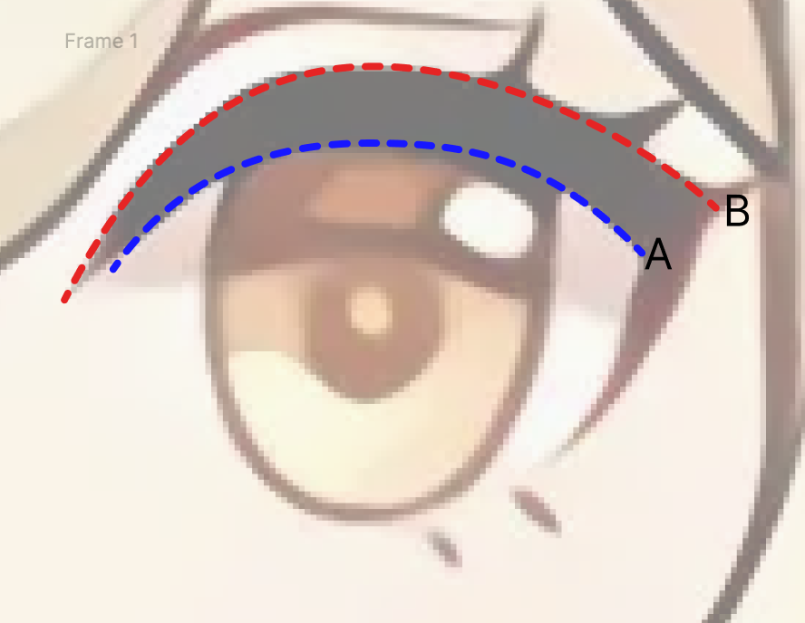
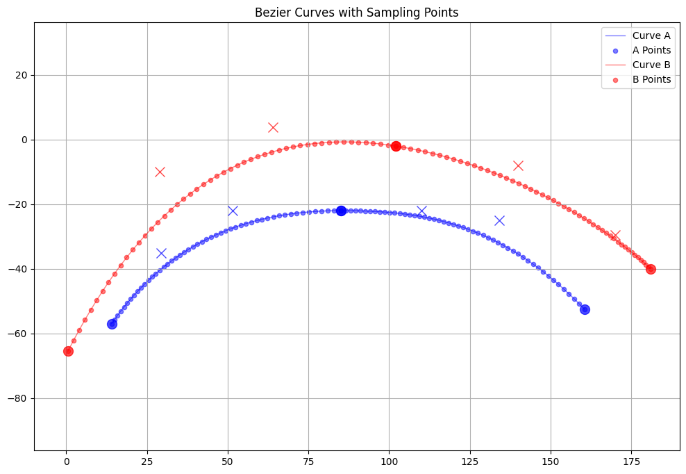
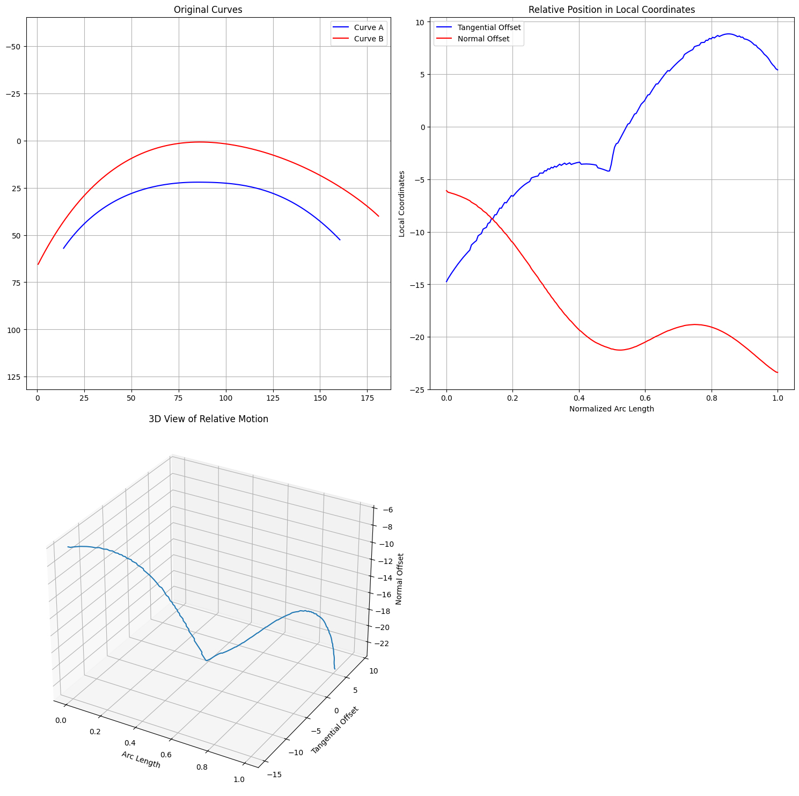
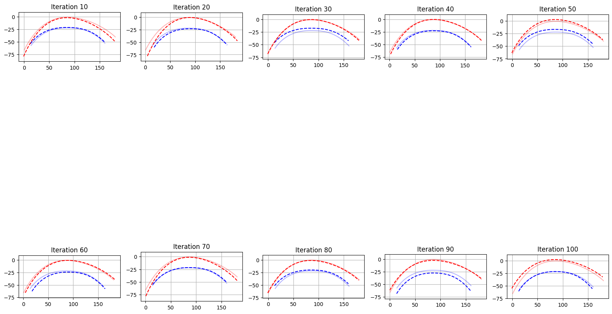
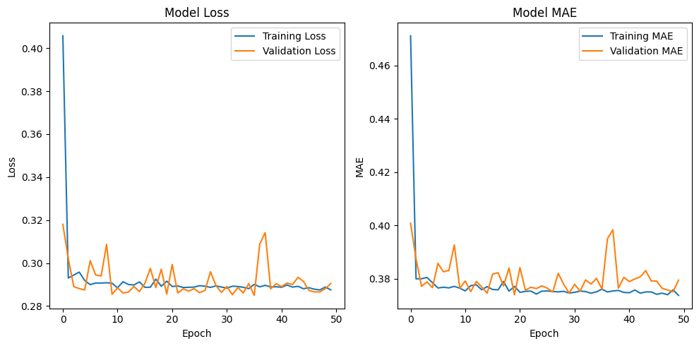
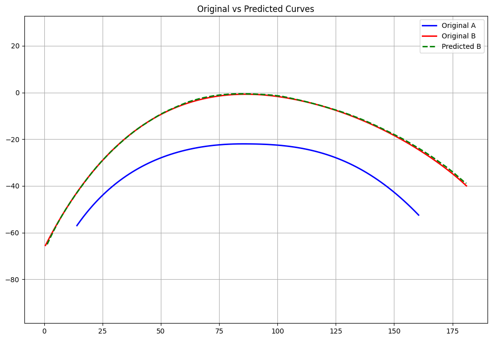
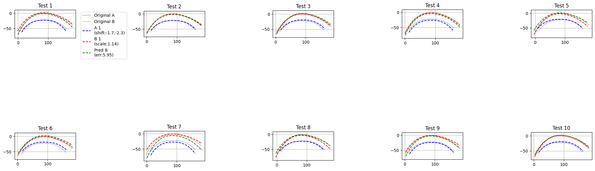

# 基于深度学习的动漫角色眼睫毛曲线自动生成研究

## 摘要

本研究提出了一种基于多层感知机（MLP）的深度学习方法，用于自动生成动漫角色的眼睫毛曲线。通过分析眼眶轮廓与眼睫毛之间的几何关系，建立了一个端到端的预测模型。实验结果表明，该方法能够有效地捕捉眼睫毛的形态特征，平均误差为5.02±2.81像素，为动画制作提供了一种高效的自动化解决方案。



## 1. 引言

在动漫角色设计中，眼部细节的刻画对角色表现力具有重要影响。眼睫毛作为眼部重要的特征元素，其绘制需要考虑与眼眶轮廓的协调性，这往往需要专业动画师投入大量时间和精力。本研究旨在通过深度学习技术，实现眼睫毛曲线的自动生成，提高动画制作效率。

## 2. 研究方法

### 2.1 数据表示

本研究采用曲线参数化方法，将眼眶曲线（曲线A）和眼睫毛曲线（曲线B）转换为统一的参数表示。通过建立局部坐标系，将复杂的空间关系分解为切向和法向分量，为深度学习模型提供了规范化的输入特征。

设 $\gamma_A(t)$ 和 $\gamma_B(t)$ 分别表示眼眶和眼睫毛曲线，其中 $t \in [0,1]$ 为归一化弧长参数。曲线参数化表示为：

$\gamma_A(t) = (x_A(t), y_A(t))$
$\gamma_B(t) = (x_B(t), y_B(t))$

在曲线A上任意点的切向量 $T(t)$ 和法向量 $N(t)$ 计算如下：

$T(t) = \frac{\gamma_A'(t)}{|\gamma_A'(t)|}$
$N(t) = (-T_y(t), T_x(t))$



### 2.2 网络架构

模型采用多层感知机结构，前向传播过程如下：

对于每一层 $l$，输出 $h^{(l)}$ 的计算为：

$h^{(l)} = \text{ReLU}(W^{(l)}h^{(l-1)} + b^{(l)})$

其中 $W^{(l)}$ 和 $b^{(l)}$ 分别为该层的权重和偏置。

最终输出层产生偏移预测：

$[\Delta s, \Delta n] = W^{(out)}h^{(L)} + b^{(out)}$

其中 $\Delta s$ 和 $\Delta n$ 分别为切向和法向偏移量。

训练配置：

* 优化器：Adam
* 损失函数：

$L_{MSE} = \frac{1}{N}\sum_{i=1}^N(\hat{y}_i - y_i)^2$

* 评估指标：

$MAE = \frac{1}{N}\sum_{i=1}^N|\hat{y}_i - y_i|$

### 2.3 相对运动分析

通过弧长参数化和局部坐标系转换，我们建立了曲线间相对位置关系的数学模型。曲线B上任意点的位置可以用曲线A的局部坐标系表示：

$$\gamma_B(t) = \gamma_A(s) + \Delta s(s)T(s) + \Delta n(s)N(s)$$

其中 $s$ 为曲线A上的对应参数值，$(\Delta s, \Delta n)$ 为预测的偏移量。



### 2.4 曲线参数化

公式定义如下：

$$
\begin{cases}
X = L_A \cdot s \\
Y = x_B(t(s)) \\
Z = y_B(t(s))
\end{cases}
$$

其中：$L_A$ 为曲线A的长度，$s$ 为归一化弧长参数，$t(s)$ 为曲线B上对应点的参数值。


## 3. 实验结果与分析

### 3.1 训练数据生成

为增强模型的泛化能力，对训练数据进行了随机移动和缩放增强：



### 3.2 定量评估

模型性能指标：
```
验证统计：
平均误差：5.0212 ± 2.8087像素
最小误差：1.8515像素
最大误差：11.9900像素
```

### 3.3 训练过程分析

损失函数和MAE的收敛过程：



### 3.4 预测效果

模型在测试集上的预测结果：





## 4. 应用价值

本研究的成果可应用于：
1. 动画制作流程自动化
2. 角色设计标准化
3. 新手动画师培训辅助
4. 批量角色处理

## 5. 技术实现

### 5.1 依赖环境
- NumPy：数值计算
- TensorFlow：深度学习框架
- Matplotlib：数据可视化
- SciPy：科学计算
- svg.path：SVG路径处理

### 5.2 代码实现
主要研究内容在`research.ipynb`笔记本中实现，包含完整的数据处理、模型训练和评估流程。

## 6. 结论

本研究提出的深度学习方法成功实现了动漫角色眼睫毛的自动生成，具有以下特点：
1. 准确捕捉眼眶与眼睫毛的空间关系
2. 保持角色风格一致性
3. 显著提高制作效率
4. 为动画制作提供可靠的自动化工具

## 版权声明

 Kigland Research。保留所有权利。
